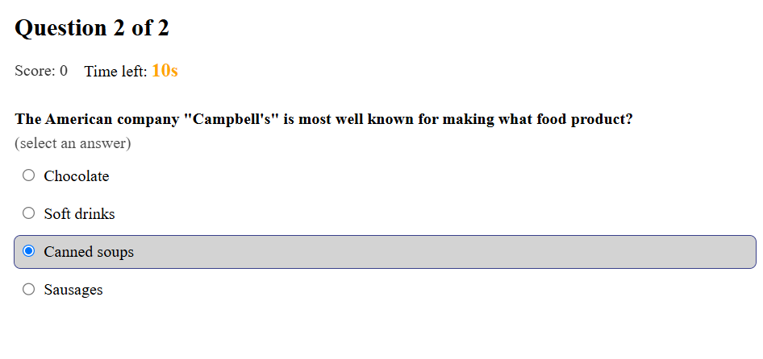

# QuizBlitz ⚡

Fast-paced trivia at your fingertips.

|  |
| :---------------------------------------: |
|      _Image 1 — View when playing._       |

|  |
| :------------------------------------------: |
|        _Image 2 — The results page._         |

> Note: This is not the final version of the UI.

## 📚 Overview

**QuizBlitz** is a lightweight trivia app built with **React.js**.

The project is deployed to a Vercel website [(Click here)](quizblitz-tawny.vercel.app) for you to test the app right away!

---

## ✨ Features

- **Fetch Questions** - Pull multiple-choice trivia from the Open Trivia DB.
- **Timer & Score Tracking** - Per-question countdown with running score.
- **Multiple-Choice Selection** - Tap to lock your answer; clear feedback on correct/incorrect.
- **Leaderboard (Firebase)** - Submit your score and see the top players.
- **Local Persistence** - Saves player name and preferences in your browser between sessions.

---

## 🛠️ Tech Stack

- **Frontend:** React.js v.19
- **Styling:** CSS
- **Data:** Open Trivia DB API
- **Backend/DB:** Firebase (Cloud Firestore) for leaderboard
- **Data Storage:** localStorage
- **Linting & Formatting:** ESLint, Prettier
- **Package Manager:** npm

---

## 🚀 Getting Started

1. **Clone the repository:**

    ```bash
    git clone https://github.com/Wilfried-O/quizblitz.git
    ```

2. **Navigate to the project directory:**

    ```bash
    cd quizblitz
    ```

3. **Install dependencies:**

    ```bash
    npm install
    ```

4. **Start the development server:**

    ```bash
    npm start
    ```

5. **Open in your browser:**  
   [http://localhost:3000](http://localhost:3000)

---

## 📋 Project Status

- ✅ **Initial Cleanup:** Removed default React boilerplate (logos, tests, `reportWebVitals.js`, etc.)
- ✅ **Branding & Header:** Logo + wordmark
- ✅ **Completed features:**
    - Core quiz flow (fetch questions, show choices, submit answers)
    - Timer (drift-free) and scoring logic
    - Post-quiz summary (final score, correct answers)
- ✅ **UX improvement:**
    - Replace free-text category with a real category dropdown from Open Trivia DB categories.
- ⚙️ **Work in Progress:**
    - UI improvement: polish the look and use logo/branding mark/icons
    - Maintenance: major refactoring (component extraction, CSS modules, etc.)

### 🧭 Next Steps

- Firebase leaderboard integration
- Dark mode
- Persistent player alias + theme toggle
- Responsive design: Mobile-friendly
- Accessibility (keyboard navigation, focus states, ARIA labels)
- Share score (copyable image)

---

## 🤖 AI Assistance

This project uses AI assistance for planning, coding, and debugging.  
All code is reviewed and fully understood by the author to ensure quality, clarity, and safety.

---

## 📄 License

This project is licensed under the **MIT License**.
